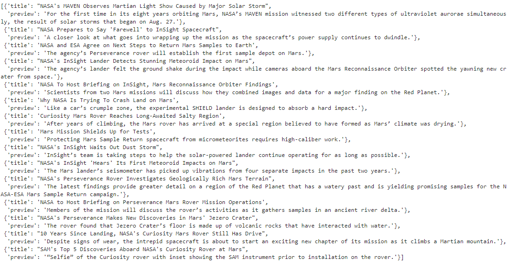
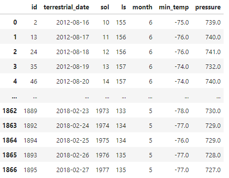
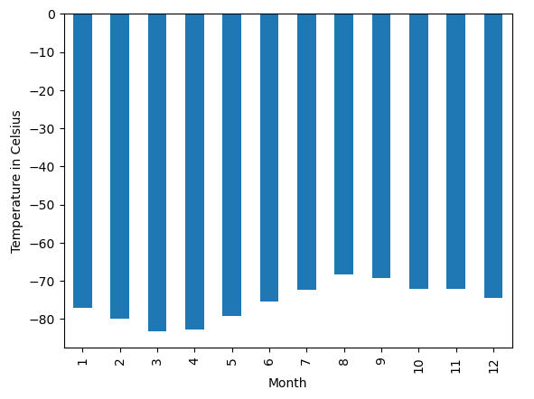
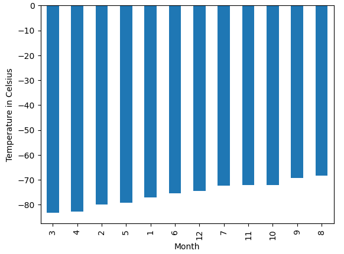
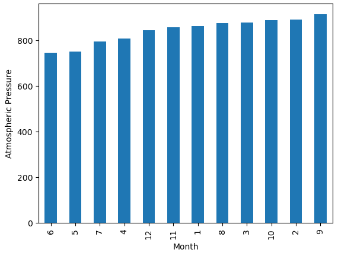
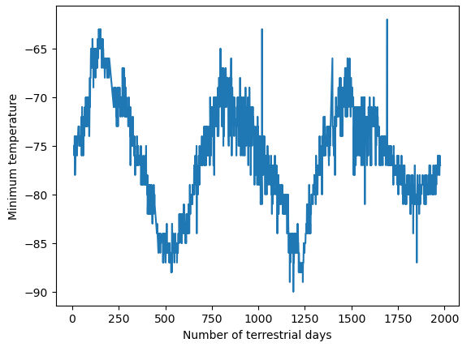

**WEB-SCRAPING CHALLENGE**

**(1) Project Overview and Purpose:**

The purpose of this exercise is identify HTML elements on a webpage, including their id and class attributes, and use this knowledge to extract information via both automated browsing with Splinter and HTML parsing with Beautiful Soup. This will include HTML tables and recurring elements, like multiple news articles on a webpage. After collecting data, it will be organized, stored, and analyzed, after which insights will be visually communicated.

**(2) Dataset Description:**

Part I uses data from the website, https://static.bc-edx.com/data/web/mars_news/index.html. It is comprised of articles about Mars news.

Part II uses data from the website, https://static.bc-edx.com/data/web/mars_facts/temperature.html. It is comprised of Mars temperature (and other weather) data.

**(3) Data Cleaning and Preprocessing:**

There was no data cleaning in Part I. Data was scraped from website as is.

For Part II, several data types were changed from object to integer; float; and datatime prior to analysis.

**(4) Data Visualization Techniques:**

(a) Part I generated in an articles list generated via .ipynb code.

(b) Part II generated a DataFrame; three bar charts; and a histogram.

**(5) Results and Analysis:**

(a) Part I- list of articles on  https://static.bc-edx.com/data/web/mars_news/index.html

(b) Part II Outputs-

Pandas DataFrame of Scraped Data:

Average Temperature by Month:

Coldest and hottest months in Curiosity's location:

Average Pressure by Month:

Terrestrial Days in Martian year:

ANALYSIS:

Which month, on average, has the lowest temperature? The highest?

_On average, the third month has the coldest minimum temperature on Mars, and the eighth month is the warmest. But it is always very cold there in human terms_

Which month, on average, has the lowest atmospheric pressure? The highest?

_Atmospheric pressure is, on average, lowest in the sixth month and highest in the ninth._

How many terrestrial days exist in a Martian year? A visual estimate within 25% was made.

_The distance from peak to peak is roughly 1425-750, or 675 days. A year on Mars appears to be about 675 days from the plot. Internet search confirms that a Mars year is equivalent to 687 earth days._

**(6) Ethical Considerations:**

The dataset for this exercise is publically available on a website, but may also be available via other electronic resources. It is not considered sensitive information.

**(7) Instructions for Interacting with the Project:**

(a) Part 1: Scrape Titles and Preview Text from Mars News - code posted in the main folder as an .ipynb filed titled "part_1_mars_news_roop.ipynb"

(b) Part 2: Scrape and Analyze Mars Weather Data - posted in the main folder will be-

     (i) an .ipynb file titled "part_2_mars_weather_roop.ipynb"

     (ii) a .csv file posted in a file titled "module_11_challenge_roop.csv"

(c) A .csv file named "module_11_challenge_roop.csv" was generated and saved to the main folder.

**(8) Citations:**

(a) Convert Python List to Json. (2024). Retrieved from https://www.geeksforgeeks.org/convert-python-list-to-json/

(b) Xpert Learning Associate - questions regarding:

     (i) Saving JSON output to local repository

     (ii) Use of To_Datetime conversion

     (iii) Positional arguments using .sort_values()

     (iv) Directory question for saving .csv files

     (v) Code syntax questions when errors received
